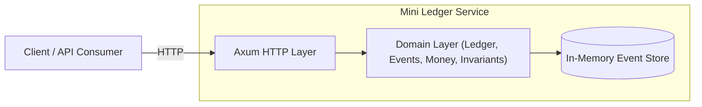
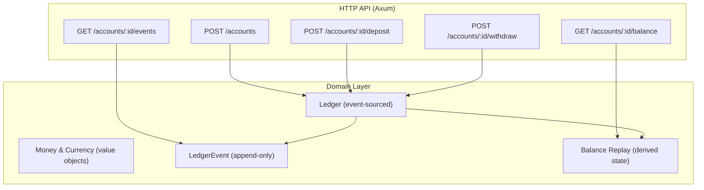
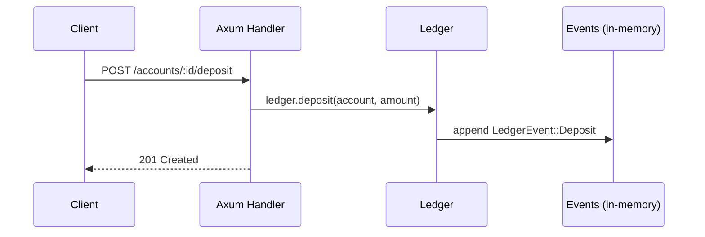

# Mini Ledger Service

A small, self-contained **event-sourced ledger** implemented in **Rust** using **Axum**.

This project demonstrates:

- clean domain modelling
- value objects (`Money`, `Currency`)
- append-only event sourcing
- derived state (balance replay)
- API boundary separated from domain logic
- error handling and invariants
- idiomatic Rust with Clippy compliance

---

## Features

- Create new accounts  
- Deposit funds  
- Withdraw funds (no overdraft allowed)  
- Fetch current balance (derived from events)  
- View full audit trail (account events)

Everything is in-memory and append-only.

---

## Core Concepts

### **Account**
A logical balance-holding entity identified by a UUID.  
Accounts do not store a numeric balance. They are reconstructed entirely from events.

### **Ledger Event**
Immutable record of a business fact.

Current event types:

- `ACCOUNT_OPENED`
- `DEPOSIT`
- `WITHDRAWAL`

Every event has:

- `id` — unique UUID  
- `account_id`  
- `created_at`  
- `payload` (event type + data)

Events are append-only and never mutated.

### **Money**
A value object representing an amount in **minor units** (e.g. pence) with a currency.  
Money can never be negative. Arithmetic uses checked operations to enforce safety.

### **Balance**
Balances are **derived** by replaying events.

Withdrawals require sufficient funds.

## Architecture

### System Context


### High Level



### Sample event flow



## Running the Service

Requires Rust 1.91+.

```bash
cargo run
```

Then in another terminal:

```bash
curl -X POST http://localhost:3000/accounts
```

Or use Insomnia / Postman.

Testing

```bash
cargo test
```

## API Overview

All endpoints return JSON.

---

### **GET `/health`**
Liveness / readiness probe.

**Response:**
```json
{ "status": "ok" }
```

---

### **POST `/accounts`**
Create a new account.

**Response:**
```json
{ "id": "..." }
```

---

### **POST `/accounts/:id/deposit`**
Deposit money into an account.

**Request:**
```json
{
  "amount_minor": 1000,
  "currency": "GBP"
}
```

**Response:**
```json
{
  "id": "...",
  "account_id": "...",
  "amount_minor": 1000,
  "currency": "GBP"
}
```

---

### **POST `/accounts/:id/withdraw`**
Withdraw money, enforcing **no overdraft**.

**Request:**
```json
{
  "amount_minor": 300,
  "currency": "GBP"
}
```

**Response:**
```json
{
  "id": "...",
  "account_id": "...",
  "amount_minor": 300,
  "currency": "GBP"
}
```

**Insufficient funds example:**
```json
{ "error": "Insufficient funds" }
```

---

### **GET `/accounts/:id/balance`**
Return the derived balance for the account.

**Response:**
```json
{
  "account_id": "...",
  "amount_minor": 700,
  "currency": "GBP",
  "display": "£7.00"
}
```

---

### **GET `/accounts/:id/events`**
Return the full event stream (audit trail) for the account.

**Example:**
```json
[
  {
    "id": "...",
    "account_id": "...",
    "created_at": "...",
    "payload": { "type": "ACCOUNT_OPENED" }
  },
  {
    "id": "...",
    "account_id": "...",
    "created_at": "...",
    "payload": {
      "type": "DEPOSIT",
      "amount_minor": 1000,
      "currency": "GBP"
    }
  }
]
```

## Why This Exists

Written as a compact example to demonstrate:

- event sourcing
- invariants and safety
- a small but extensible example of a webserver in rust
- clean Rust API design
- separation of domain and transport
- stable and auditable money handling

## Future Extensions (not implemented)

These would be natural next steps but are not included in the current minimal version:

- Persistent event store (Postgres, SQLite, EventStoreDB)
- Transfers (TRANSFER_DEBIT / TRANSFER_CREDIT)
- Idempotency keys
- Multi-currency support
- OpenAPI documentation
- Replay performance optimisations

